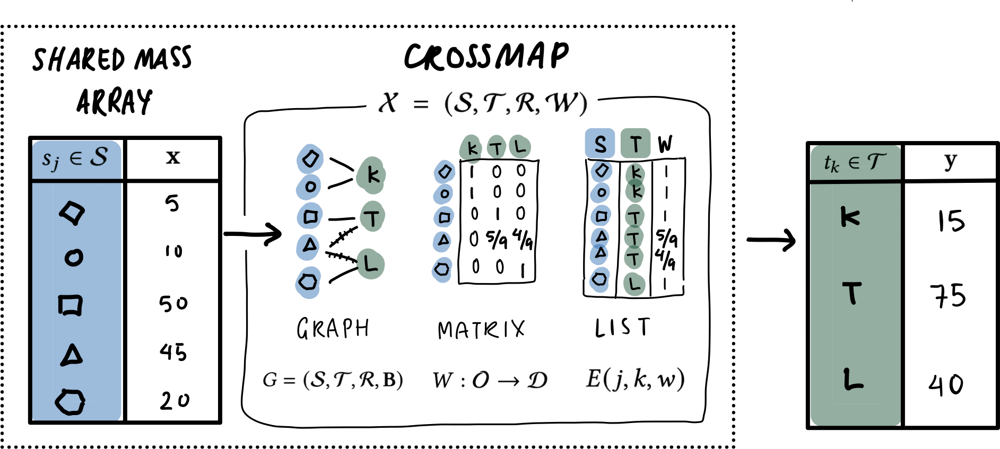
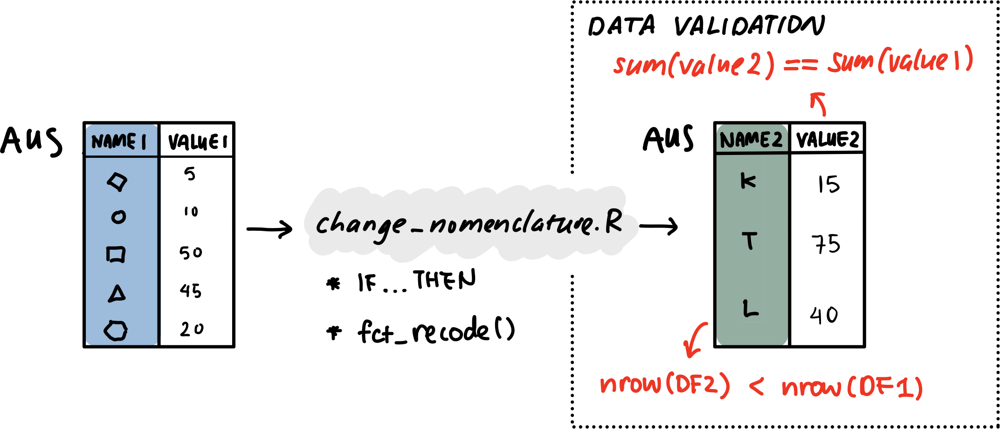
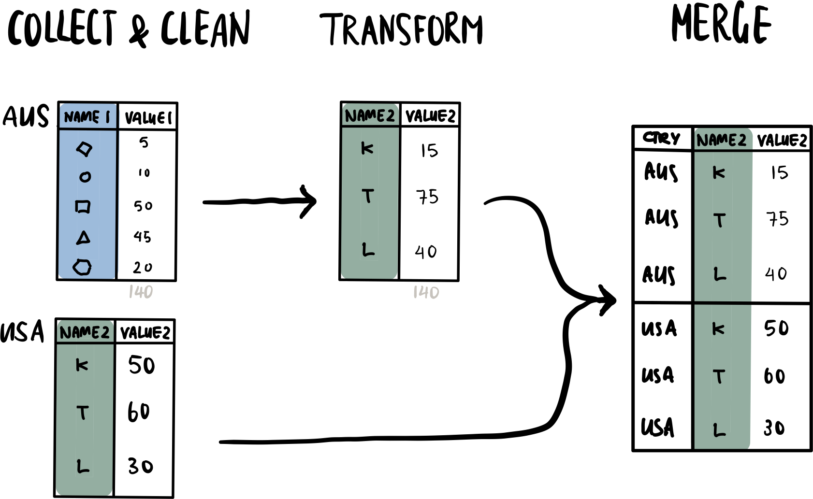
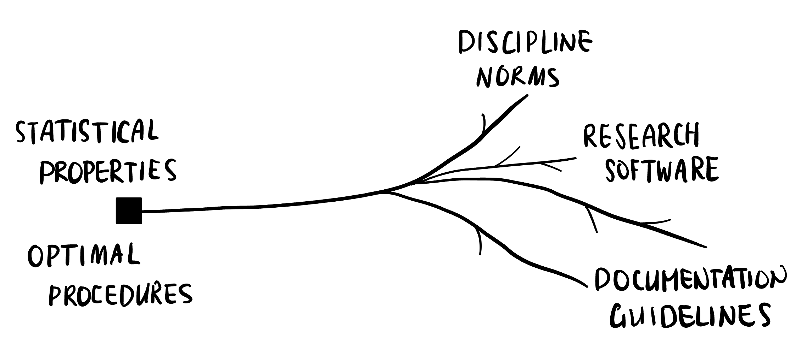
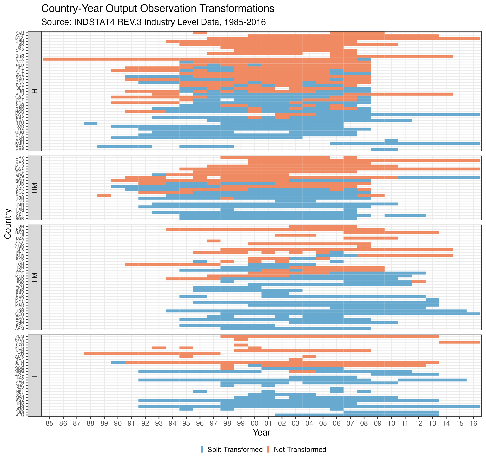
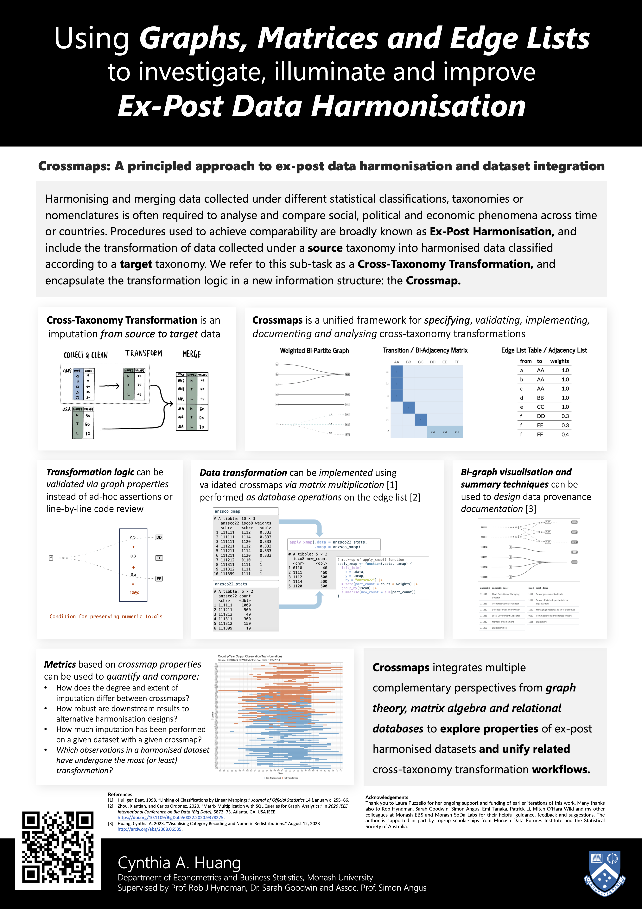

# Images for Crossmaps Project


## Submoduling Instructions

Run these commands from inside the target repo (i.e. the one you want
these images to be available in)

To add the contents of the latest commit of the default branch of this
repo as the folder `images/`:

``` zsh
git submodule add https://github.com/cynthiahqy/collection_crossmap-images.git images
```

Updating contents to match the latest commit:

``` zsh
git submodule update --remote --merge
```

## Images

## Illustrations

illustrations/diagram_crossmap-transform-latex.png



illustrations/diagram_current-prov.png



illustrations/diagram_ex-post-process.png



illustrations/diagram_preprocessing-solutions.png



illustrations/icon-database.png


illustrations/icon-IEEE-VIS.png


illustrations/icon-official-stats.png


## Plots

plots/plot-isiccomb-split-by-income-groups.png



## Screenshots

screenshots/asc-poster.png


